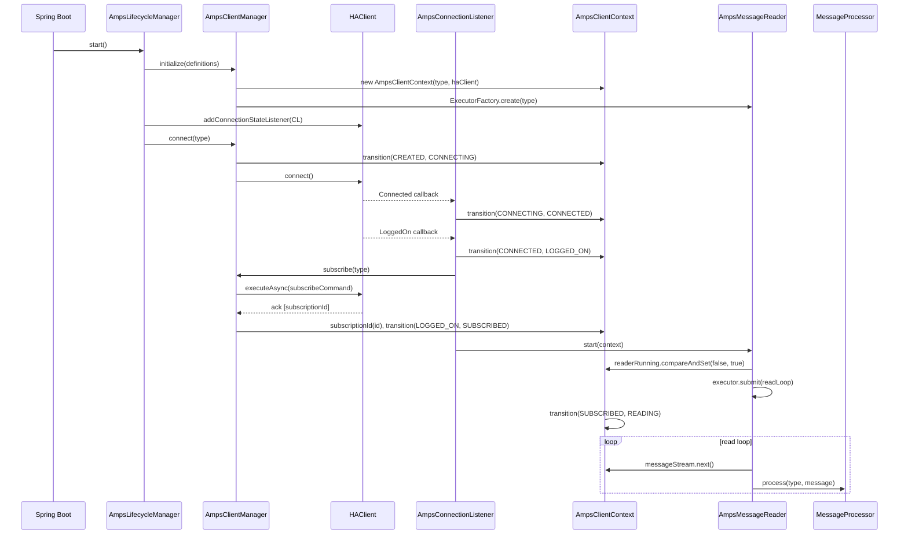
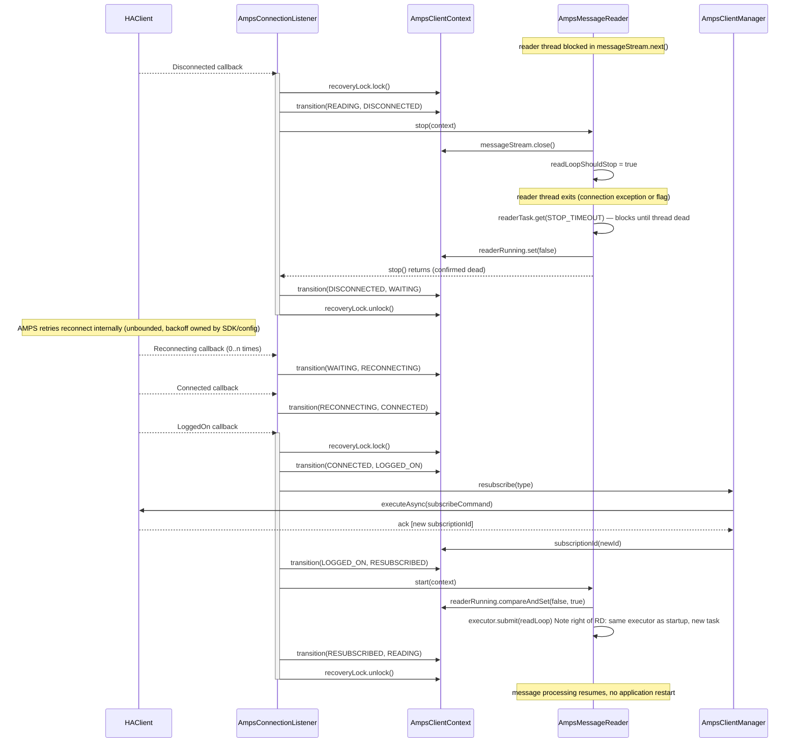
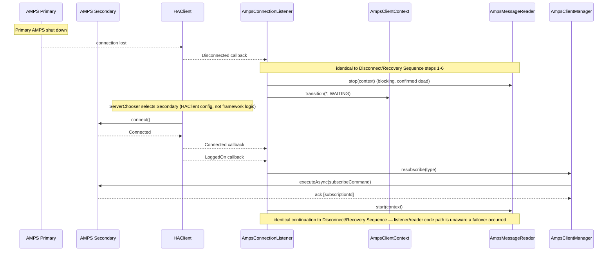
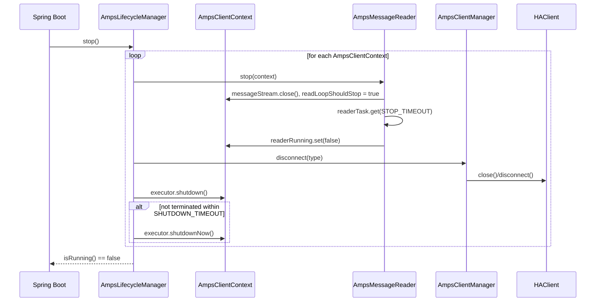

# SEQUENCE_DIAGRAM.md — AMPS HA Client Reconnection Framework

Mermaid sequence diagrams for the four flows defined in `CALL_FLOW.md`. Participant names match class
names in the planned package structure (`ARCHITECTURE.md` §2) exactly, so these diagrams can be checked
directly against the implementation.

> **Threading note:** the diagrams below show `AmpsConnectionListener` calling `stop()`/`resubscribe()`/
> `start()` directly for readability. In the implementation those calls are enqueued onto a per-client
> `recoveryExecutor` rather than executed inline on the AMPS callback thread — see `THREADING_MODEL.md` §4.
> The ordering and locking guarantees shown are unaffected; only which thread executes them changes.

---

## 1. Startup Sequence

---

## 2. Disconnect / Recovery Sequence

---

## 3. Failover Sequence

---

## 4. Shutdown Sequence

